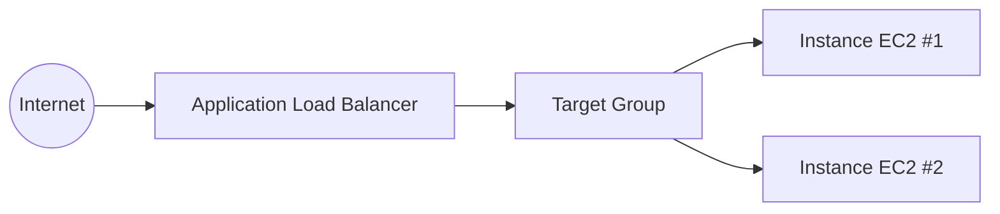
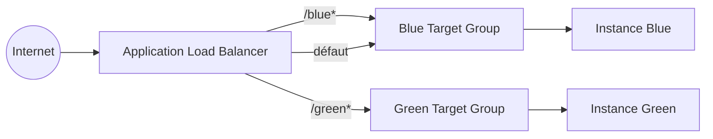

# AWS ALB Deployment Patterns

[](https://github.com/Julionores/aws-alb-deployment-patterns/actions/workflows/ci.yml)

Deux patterns de déploiement courants avec un **Application Load Balancer**, tous deux
complétés à partir de templates de cours incomplets : l'ASG et les instances existaient,
mais jamais l'ALB, les Target Groups ni les règles qui les relient réellement au trafic.

> Projet réalisé par **Junior Tsafack Megnekeu** ([blog.jtmcloud.com](https://blog.jtmcloud.com) ·
> [GitHub](https://github.com/Julionores) ·
> [LinkedIn](https://www.linkedin.com/in/junior-tsafack-megnekeu-b673151b9)) — pièce d'un
> portfolio technique orienté Cloud/DevOps. Voir aussi
> [`dynamodb-streams-cdc-pipeline`](https://github.com/Julionores/dynamodb-streams-cdc-pipeline),
> [`aws-troubleshooting-challenge`](https://github.com/Julionores/aws-troubleshooting-challenge),
> [`s3-cross-region-replication`](https://github.com/Julionores/s3-cross-region-replication) et
> [`aws-vpc-connectivity-patterns`](https://github.com/Julionores/aws-vpc-connectivity-patterns).
> Côté DevSecOps/Full Stack, voir aussi
> [`devsecops-pipeline-reference`](https://github.com/Julionores/devsecops-pipeline-reference),
> [`securebank-api`](https://github.com/Julionores/securebank-api),
> [`postgresql-ha-repmgr`](https://github.com/Julionores/postgresql-ha-repmgr) et
> [`iso27001-isms-toolkit`](https://github.com/Julionores/iso27001-isms-toolkit).
> Côté Machine Learning, voir aussi [`gradientforge`](https://github.com/Julionores/gradientforge),
> [`radar-risque-impaye`](https://github.com/Julionores/radar-risque-impaye),
> [`collecte-agricole-planner`](https://github.com/Julionores/collecte-agricole-planner) et
> [`ticket-tide`](https://github.com/Julionores/ticket-tide), une prévision de série
> temporelle (famille ARMA).

## Pattern 1 — ALB devant un Auto Scaling Group

`cloudformation/template-basic-alb-asg.yaml` : le pattern web-tier classique. Un ALB
distribue le trafic vers un Auto Scaling Group de 2 à 4 instances, avec un security group
dédié à l'ALB (seul point d'entrée public) et un security group applicatif qui n'accepte le
trafic **que** depuis l'ALB — jamais directement depuis Internet.



### Vérification réelle

Déployé sur un compte AWS réel (`eu-west-1`) :

```bash
$ curl http://<alb-dns>/
<html><body><h1>Instance ID: i-0d01fb9ce08ddf048</h1></body></html>

$ curl http://<alb-dns>/
<html><body><h1>Instance ID: i-0038723a00ae1893a</h1></body></html>
```

Deux requêtes successives atteignent deux instances différentes de l'ASG : la répartition
de charge fonctionne réellement, pas seulement sur le papier. Les deux cibles étaient
`healthy` dès le premier contrôle de santé après déploiement.

## Pattern 2 — Routage par chemin (path-based routing)

`cloudformation/template-path-based-routing.yaml` : un seul ALB expose deux versions
distinctes d'une application (« Blue » et « Green ») sur des chemins différents
(`/blue*` et `/green*`), chacune derrière son propre Target Group — utile pour un
déploiement progressif ou pour exposer plusieurs environnements derrière un point d'entrée
unique.



### Vérification réelle

```bash
$ curl http://<alb-dns>/blue/
<h1 style='color:blue'>I AM BLUE</h1>

$ curl http://<alb-dns>/green/
<h1 style='color:green'>I AM GREEN</h1>
```

Chaque chemin atteint bien l'instance attendue.

## Ce qui a été corrigé par rapport aux templates de cours d'origine

| | Cours d'origine | Ce dépôt |
|---|---|---|
| ASG / instances Blue-Green | ✅ | ✅ |
| **ALB, Target Group(s), Listener** | ❌ absents | ✅ ajoutés |
| Règles de routage par chemin | ❌ | ✅ (`ListenerRule` avec `path-pattern`) |
| Security group applicatif ouvert à Internet | ⚠️ (port 80 depuis `0.0.0.0/0`) | ✅ restreint au security group de l'ALB uniquement |
| AMI codée en dur | ⚠️ ID d'AMI figé, périmable | ✅ résolue dynamiquement via SSM Parameter Store |

## Déploiement

```bash
# Pattern 1
aws cloudformation deploy \
  --template-file cloudformation/template-basic-alb-asg.yaml \
  --stack-name alb-asg-demo --region eu-west-1

# Pattern 2
aws cloudformation deploy \
  --template-file cloudformation/template-path-based-routing.yaml \
  --stack-name alb-path-routing-demo --region eu-west-1
```

Nettoyage : `aws cloudformation delete-stack --stack-name <nom>`.

## Validation

```bash
pip install cfn-lint
cfn-lint cloudformation/template-basic-alb-asg.yaml
cfn-lint cloudformation/template-path-based-routing.yaml
```

> 💡 `cfn-lint` a détecté une vraie erreur pendant la rédaction de ces templates : la
> description d'un `AWS::EC2::SecurityGroup` (`GroupDescription`) n'accepte pas l'apostrophe
> dans son jeu de caractères autorisé — une contrainte AWS peu documentée mais bloquante au
> déploiement.

## Limites assumées

- Pattern 2 utilise des instances EC2 statiques (pas d'ASG) : adapté à une démonstration du
  routage par chemin, pas à un environnement de production qui voudrait aussi la
  scalabilité automatique de chaque couleur.
- Aucun HTTPS/certificat ACM configuré : les deux patterns exposent du HTTP simple, à but de
  démonstration.

## Licence

MIT — voir [`LICENSE`](LICENSE). Projet à but pédagogique et de démonstration.
